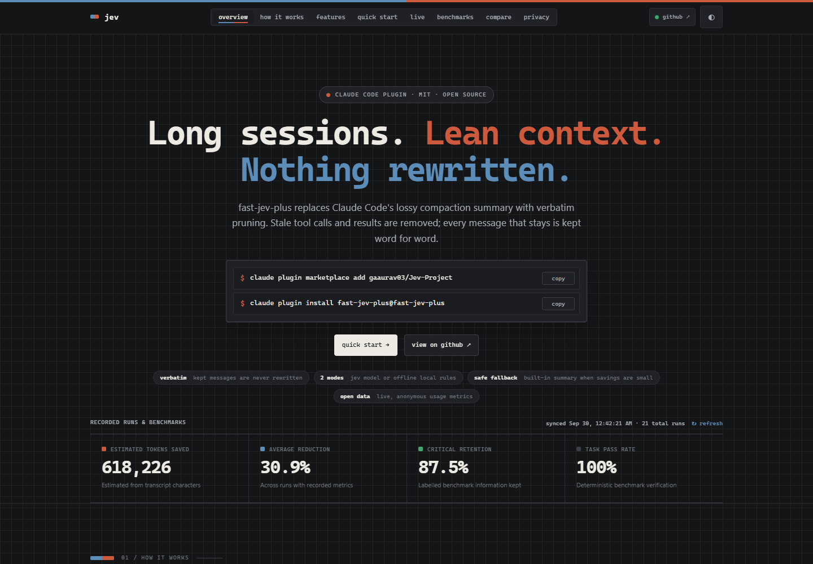

# fast-jev-plus

**Verbatim context compaction for Claude Code.** Instead of replacing your
history with a lossy summary, fast-jev-plus removes only the tool calls and
results that are no longer needed. Every message that stays is kept word for
word.

[**Live dashboard**](https://jev-project-bay.vercel.app) ·
[Quick start](#quick-start) ·
[How it works](#how-it-works) ·
[Benchmarks](#benchmarks) ·
[Privacy](#privacy-and-telemetry)



## Why

When a Claude Code session fills up, `/compact` asks a model to summarize the
old turns. Summaries are lossy: an exact file path, error message, command, or
constraint can disappear right when it matters.

fast-jev-plus never rewrites anything. It scores every tool call and tool
result, deletes the stale ones (an outdated file read, a superseded test run),
and hands Claude Code the original messages. If it can't save enough, it steps
aside and lets the built-in summary run.

```text
fast-jev-plus: kept 20/140 messages, no summary (98% reduction; 60 call_dropped, 3 pinned; …)
```

## Features

| | |
| --- | --- |
| **Verbatim pruning** | Removes whole tool calls or truncates their results. Kept messages are the original objects, unchanged. |
| **Two modes** | `jev` scores every call with the Jev model in one fast request. `local` uses offline, deterministic rules with no API key and no network. |
| **Outbound redaction** | Bearer tokens, API keys, passwords, private keys, emails, and phone numbers are stripped from anything sent to Jev. Your transcript is untouched. |
| **Safe fallback** | Errors, timeouts, a missing key, or savings below the minimum (15% by default) hand off to Claude Code's built-in summary. |
| **Metrics** | Tokens before and after, reduction, latency, request count, and provider usage when reported. Nothing is invented. |
| **Retention benchmark** | `npm run bench` checks that labelled critical calls survive and that tasks still pass, in both modes. |
| **Run history** | Every run is appended to `.jev/runs.jsonl` with decisions, never prompts or tool output. |
| **Dashboards** | A private dashboard on `127.0.0.1`, and a [public one](https://jev-project-bay.vercel.app) with anonymous community totals. |

## Quick start

Requires Claude Code **2.1.274+** (function hooks are an early-access feature).

**1. Enable function hooks.** Add this to `~/.claude/settings.json`. The API key
is only needed for `jev` mode.

```json
{
  "env": {
    "CLAUDE_CODE_ENABLE_FUNCTION_HOOKS": "1",
    "TYPESAFE_API_KEY": "<your TypeSafe key>"
  }
}
```

> Put these in `settings.json`, not only in a shell. Without
> `CLAUDE_CODE_ENABLE_FUNCTION_HOOKS`, Claude Code does not load the hook and
> `/compact` silently uses the built-in summary.

**2. Install the plugin** from a terminal, or run the same commands as slash
commands inside Claude Code:

```sh
claude plugin marketplace add gaaurav03/Jev-Project
claude plugin install fast-jev-plus@fast-jev-plus
```

**3. Choose a mode.** Open `/config` and set `mode`:

- `jev` (default): the most savings; needs `TYPESAFE_API_KEY`.
- `local`: offline and the most conservative; no key needed.

**4. Restart Claude Code** (or run `/reload-plugins`), then run `/compact` or let
it trigger automatically at 60% context. The toast reports what happened:

- `kept N/M messages, no summary (…)`: the pruned, verbatim history was applied.
- `fallback to built-in summary (…)`: not enough to remove (common in short
  sessions) or an error; Claude Code's own summary ran instead.

**Update or remove**

```sh
claude plugin marketplace update fast-jev-plus
claude plugin update fast-jev-plus@fast-jev-plus
claude plugin uninstall fast-jev-plus@fast-jev-plus
```

## Configuration

Plugin options are set with `/config` (stored in Claude Code's settings).

| Option | Default | What it does |
| --- | --- | --- |
| `mode` | `jev` | `jev` for model scoring, `local` for offline deterministic rules |
| `apiKey` | – | TypeSafe key; leave unset to use `TYPESAFE_API_KEY` |
| `telemetry` | `true` | Share anonymous usage counts ([details](#privacy-and-telemetry)) |
| `compactAtPercent` | `60` | Context percentage at which compaction is requested automatically |
| `minReductionRatio` | `0.15` | Minimum estimated reduction required to replace the history |
| `keepThreshold` | `0.5` | Minimum Jev probability for a call or result to stay |
| `preserveRecentMessages` | `6` | Newest messages that are never touched (the first message is always kept) |
| `truncateHeadChars` | `300` | Characters kept from a truncated tool result, followed by a note |
| `maxStateTokens` | `25000` | Estimated token budget for the conversation state sent to Jev |
| `maxRequestTokens` | `30000` | Estimated budget for state plus questions in one Jev request |
| `model` | `jev-latest` | Jev model name |

Environment variables:

| Variable | Purpose |
| --- | --- |
| `CLAUDE_CODE_ENABLE_FUNCTION_HOOKS=1` | Required for the plugin to load |
| `TYPESAFE_API_KEY` | Jev mode API key |
| `JEV_TELEMETRY=0` / `DO_NOT_TRACK=1` | Disable anonymous telemetry |
| `JEV_CLOUD_UPLOAD`, `JEV_CLOUD_INGEST_URL`, `JEV_CLOUD_INGEST_TOKEN` | Optional authenticated upload to a dashboard you host ([self-hosting](#self-host-the-public-dashboard)) |

## How it works

1. **Trigger.** `/compact`, or the `turn.complete` hook when context reaches
   `compactAtPercent`.
2. **Pair and pin.** Every `tool_use` is paired with its `tool_result`. Calls in
   the first message and the newest `preserveRecentMessages` messages are pinned.
3. **Redact.** Secrets and PII are removed from the outbound copy only.
4. **Score.**
   - `jev`: the whole conversation is sent as a compact state (tool results
     replaced by short notes, fitted into `maxStateTokens`), with two questions
     per call: should the *call* stay, and should its *result* stay verbatim?
     Questions are batched under `maxRequestTokens` and sent concurrently.
   - `local`: old, successful duplicate `Read` calls are removed; recent calls,
     errors, edits, and anything uncertain are kept.
5. **Decide** per call, against `keepThreshold`: keep call and result; keep the
   call but truncate the result to `truncateHeadChars`; or remove the call with
   its result. No result is ever left without its call.
6. **Apply or fall back.** If the estimated reduction reaches
   `minReductionRatio`, the rebuilt message list replaces the history. Untouched
   messages are the engine's own objects. Otherwise Claude Code's built-in
   compaction runs.
7. **Record.** Metrics and decision metadata are appended to `.jev/runs.jsonl`,
   then optional uploads run in parallel with a 3-second timeout.

<details>
<summary>State fitting in detail</summary>

The state is fitted into `maxStateTokens` in stages, each applied only if the
previous one was not enough: tool inputs truncated to 1000, then 200, then 60
characters; long texts abridged to head and tail, oldest non-pinned messages
first; old non-pinned messages collapsed to a `[… N chars omitted …]` note; old
tool calls reduced to one line each (`t12 Read file_path=src/a.ts → ok 480ch`);
old call-less messages left out; runs of old call-only messages folded into one
entry. If it still does not fit, compaction throws and the hook falls back.
Tokens are estimated without a tokenizer (a word per six letters, half a token
per digit, about one per other symbol), calibrated to land slightly above the
counts Jev reports.

</details>

## Benchmarks

Four labelled cases, each marking the calls and results that must survive and
running a deterministic check that the task still passes.
Recorded with `npm run bench -- --mode both` on 2026-09-30:

| Case | Jev reduction | Jev critical kept | Local reduction | Local critical kept | Task (jev · local) |
| --- | ---: | ---: | ---: | ---: | :---: |
| obsolete-read | 40.3% | 100% | 40.3% | 100% | pass · pass |
| required-error | 69.6% | **0%** | 0.0% | 100% | pass · pass |
| repeated-test | 42.4% | 100% | 0.0% | 100% | pass · pass |
| protected-constraint | 64.7% | **0%** | 0.0% | 100% | pass · pass |
| **Total** | **52.1%** | **50%** | **12.7%** | **100%** | 4/4 · 4/4 |

Jev saves about four times more context but, in two of four cases, removed
information the benchmark marks as critical. Local mode saves less and kept
everything critical. Choose `local` when exact errors and constraints must
survive; the assistant can always re-run a removed tool.

```sh
npm run bench                      # both modes, table output
npm run bench -- --mode local      # no key, no network
npm run bench -- --json            # full machine-readable report
```

Benchmark JSON cannot supply executable commands; it can only select one from
the reviewed catalog in `src/benchmark.ts`. Cost is reported only when verified
pricing is available.

## Dashboards

**Private (local).** From a clone of this repository:

```sh
npm install
npm run dashboard          # http://127.0.0.1:4310
```

It binds only to `127.0.0.1` and reads `.jev/runs.jsonl`: overview, Jev versus
local comparison, trends, filterable run history, and per-run decision
details. `GET /api/summary`, `GET /api/runs` (filters `mode`, `status`, `from`,
`to`, `limit` ≤ 200) and `GET /api/runs/:id` never return prompts, tool inputs,
keys, or raw output.

**Public.** [jev-project-bay.vercel.app](https://jev-project-bay.vercel.app)
shows community totals from anonymous telemetry plus the maintainer's uploaded
runs and benchmarks, refreshed every 30 seconds.

## Privacy and telemetry

Telemetry is **on by default** and powers the public community totals.

- **First compaction:** a random install ID is created in the plugin's own
  store and a notice is shown. Nothing is sent.
- **Every later live compaction** sends exactly this:

```json
{ "v": 1, "install_id": "<random 32 hex>", "plugin_version": "0.6.0",
  "mode": "local", "status": "applied",
  "tokens_before": 1000, "tokens_after": 600, "latency_ms": 13 }
```

Prompts, messages, code, file names, paths, tool names, tool output, run IDs,
and API keys are never sent, and benchmark runs are never sent. The server
stores no IP addresses; a daily-rotating keyed hash of the sender is used only
for rate limiting. Sending times out after 3 seconds and never changes the
compaction result.

**Opt out** with `JEV_TELEMETRY=0`, `DO_NOT_TRACK=1`, or the `telemetry` option
set to `false` in `/config`. Once opted out, no install ID is created and
nothing is sent. Self-hosters can redirect events with `JEV_TELEMETRY_URL`.

## Troubleshooting

| Symptom | Fix |
| --- | --- |
| `/compact` shows no fast-jev-plus toast | Function hooks are off. Put `CLAUDE_CODE_ENABLE_FUNCTION_HOOKS=1` in the `env` block of `~/.claude/settings.json` and restart Claude Code. |
| `fallback to built-in summary (TYPESAFE_API_KEY is not configured)` | Add the key to `settings.json` or `/config`, or switch `mode` to `local`. |
| `fallback to built-in summary (below 15% minimum …)` | Expected in short sessions. Lower `minReductionRatio` in `/config` if you want it applied more often. |
| An update is not picked up | Run `claude plugin marketplace update fast-jev-plus`, then `claude plugin update fast-jev-plus@fast-jev-plus`, and restart. |
| Where is my run history? | `.jev/runs.jsonl` at the root of the repository (or working directory) the session was started in. |

## Use as a library

```sh
npm install github:gaaurav03/Jev-Project
export TYPESAFE_API_KEY=...
```

```ts
import { compactMessages, reductionRatio, type Message } from 'fast-jev-plus';

const transcript: Message[] = [
  { role: 'user', text: 'Fix the failing test. Never edit src/generated.', toolUses: [] },
  {
    role: 'assistant',
    text: '',
    toolUses: [{ tool_use_id: 'toolu_1', tool: 'Read', input: { file_path: 'src/a.ts' } }],
  },
  { role: 'user', text: '', toolUses: [], toolResults: [{ tool_use_id: 'toolu_1', text: '…file…' }] },
  // …
];

const result = await compactMessages(transcript, { preserveRecentMessages: 4 });
// Offline alternative: compactMessages(transcript, { mode: 'local' })
console.log(result.messages, result.decisions, result.stats);
if (reductionRatio(result) < 0.15) {
  // not worth it: keep the original transcript, or summarize instead
}
```

`Message` is a subset of Claude Code's `SessionMessage`, so a session transcript
can be passed in as is. The library accepts the same options as the plugin plus
`baseUrl` (default `https://api.typesafe.ai/v1/systemone`), `fetch` (injectable
for tests), and `goal` (defaults to the last three user prompts). `apiKey`
defaults to `process.env.TYPESAFE_API_KEY`; never commit it.

To bring your own transport, implement `JevAsker` (one `ask(state, questions)`
method) and call `compact(messages, asker, options)`. `buildJevRequest` and
`parseJevResponse` build and validate the HTTP exchange, and the building blocks
(`collectToolCalls`, `fitState`, `batchCalls`, `decideCall`, `applyDecisions`)
are exported too. `result.stats` reports counts before and after, per-reason
decisions, state size, fitting stage, and requests.

## Self-host the public dashboard

<details>
<summary>Supabase + Vercel setup</summary>

1. **Supabase.** In the SQL Editor, run both migrations in
   `supabase/migrations/` in order. They create constrained tables with RLS
   enabled and no browser-role access. See [`supabase/README.md`](supabase/README.md).
2. **Vercel.** Import the repository. `vercel.json` builds the TypeScript, serves
   `dashboard/`, and sets security headers. Add these environment variables:

   ```dotenv
   SUPABASE_URL=https://your-project.supabase.co
   SUPABASE_SERVICE_ROLE_KEY=your-service-role-or-sb_secret-key
   JEV_CLOUD_INGEST_TOKEN=a-random-token-of-32-or-more-characters
   ```

3. **Your machine.** To upload your own runs and benchmarks, add to the `env`
   block of `~/.claude/settings.json`:

   ```json
   "JEV_CLOUD_UPLOAD": "1",
   "JEV_CLOUD_INGEST_URL": "https://your-project.vercel.app/api/ingest",
   "JEV_CLOUD_INGEST_TOKEN": "the same token as in Vercel"
   ```

   Point community telemetry at your deployment with
   `JEV_TELEMETRY_URL=https://your-project.vercel.app/api/telemetry`.

Endpoints: `GET /api/summary`, `GET /api/runs`, and `GET /api/community` are
public and return sanitized data only; `POST /api/ingest` requires the token;
`POST /api/telemetry` accepts only the strict anonymous event above and is rate
limited. The Supabase key never leaves Vercel.

</details>

## Development

```sh
npm install
npm run typecheck        # library + hook
npm test                 # fake Jev; never contacts TypeSafe
npm run build
npm run validate:plugin  # claude plugin validate
npm run demo             # live network check; needs TYPESAFE_API_KEY
```

To run the plugin from a checkout without installing:
`CLAUDE_CODE_ENABLE_FUNCTION_HOOKS=1 claude --plugin-dir .`

| Path | Contents |
| --- | --- |
| `src/` | Library: compaction, Jev client, redaction, local mode, metrics, benchmark, dashboard server, telemetry |
| `hooks/` | Claude Code function-hook adapter ([details](hooks/README.md)) |
| `dashboard/` | Website and dashboard (static HTML, CSS, JS) |
| `api/` | Vercel functions for the public dashboard |
| `supabase/` | Database migrations |
| `bench/` | Labelled benchmark cases |
| `demo/JevDemo` | Scripted SwiftUI animation of the flow for screen recording (macOS) |

## Limitations

- Only tool calls and results are candidates; text messages are never removed
  or shortened.
- Token counts are estimates from characters, not a tokenizer.
- A keep probability is not a proof that a result is safe to delete; the
  benchmark shows Jev can remove critical information.
- The full state is resent with every Jev request, so very long histories cost
  more requests.
- Function hooks are early access and may change between Claude Code releases.

## License

MIT. See [LICENSE](LICENSE).
